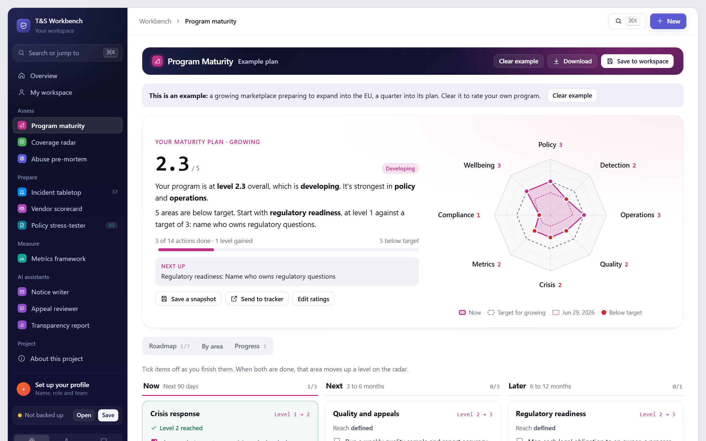
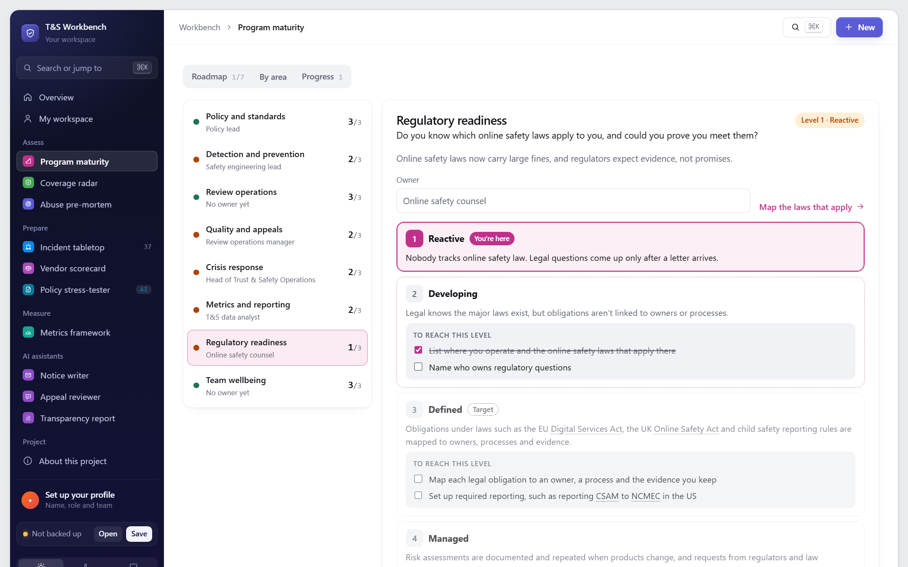
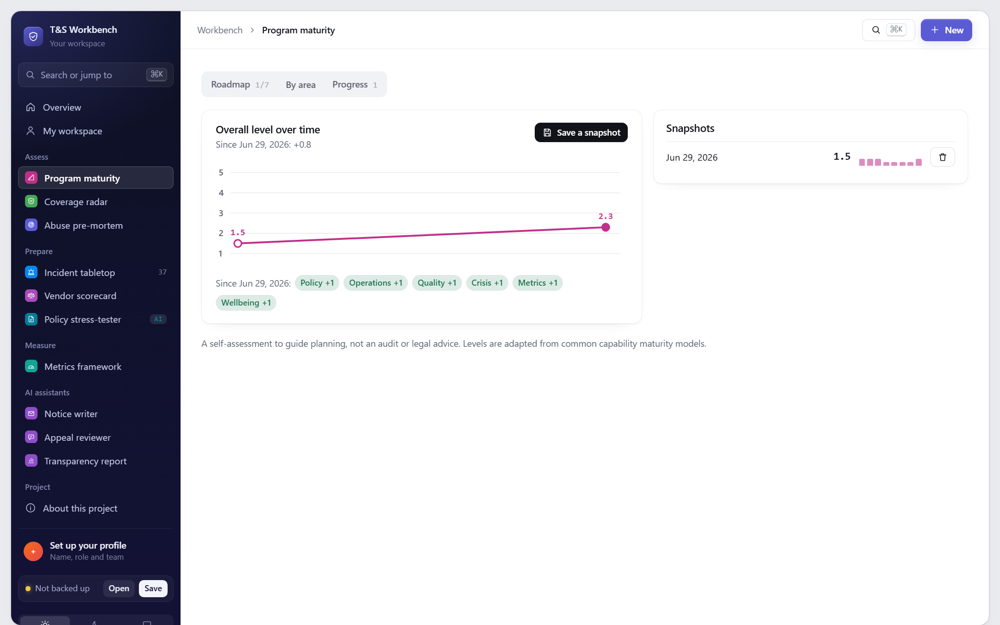
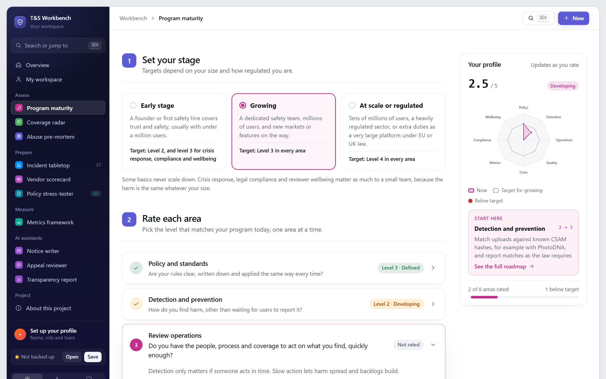
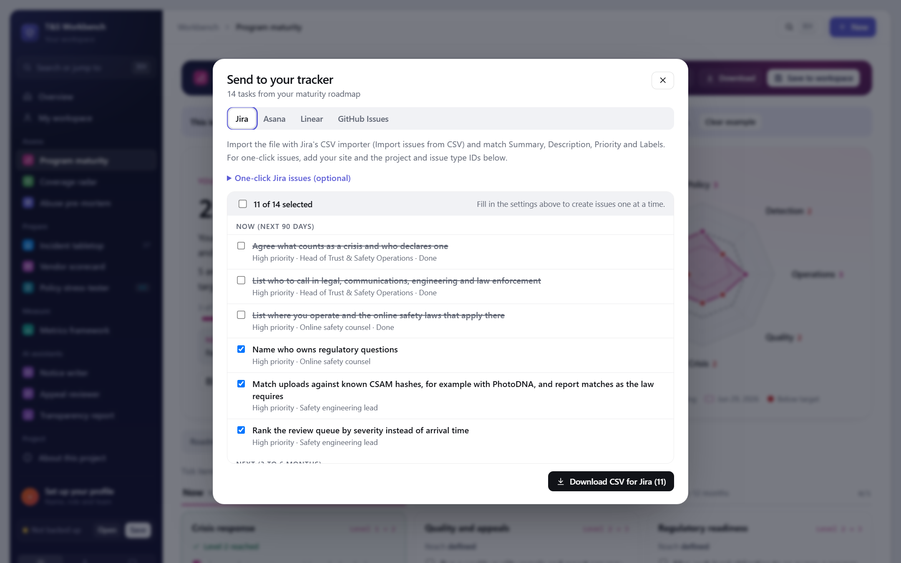
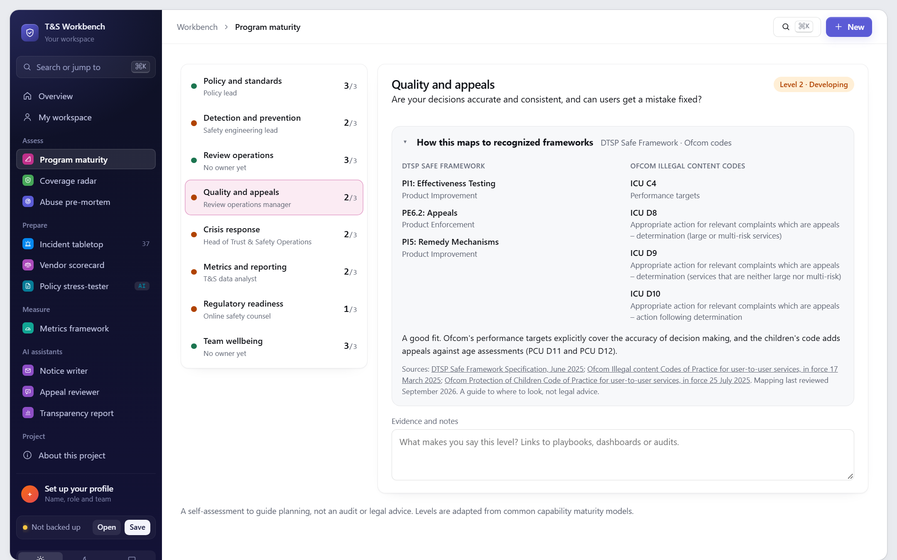

# T&S Program Maturity Model

> **How mature is your Trust & Safety program, and what should you fix first?**

Rate a Trust & Safety program in 8 areas, from policy and detection to crisis response and reviewer wellbeing, on five plain-language levels. Then work the plan: a phased roadmap with owners and due dates, where finishing the steps for a level moves that area up on the radar. Quarterly snapshots show leadership how far the program has come.

**[Try it live](https://stevenmacchia.github.io/ts-workbench/#maturity)** · part of [T&S Workbench](https://github.com/stevenmacchia/ts-workbench) · free, no sign-up

## The problem

Leaders are asked "how mature is our safety program?" by boards, regulators, acquirers and new executives, and usually answer with a gut feeling. Generic capability models don't describe what good looks like in Trust & Safety, and they rarely say what to do next or in what order.

## How it works

1. **Set your stage.** Early, growing, or at scale and regulated. Targets rise with size, but crisis response, compliance and wellbeing never drop below level 3.
2. **Rate each area.** One area at a time, pick the highest level where every statement is true today. That sets your baseline.
3. **Work the plan.** A roadmap in now, next and later, with owners and due dates. Tick off both steps for a level and the area moves up. Each area has a ladder of evidence, and snapshots track progress over time.

Send the roadmap to Jira, Asana or Linear as a CSV, or open each step as a pre-filled Jira, Linear or GitHub issue.

## What's in this repo

The tool's knowledge, published as open content you can read, reuse and adapt.

| File | What it is |
|---|---|
| [`maturity-model.md`](maturity-model.md) | 8 areas × 5 levels, with the question each area answers and why it matters |
| [`roadmap-steps.md`](roadmap-steps.md) | Two concrete steps for moving each area up each level |
| [`self-assessment.md`](self-assessment.md) | A printable worksheet version |
| [`data/maturity-model.json`](data/maturity-model.json) | The model as JSON |

## Use it for

- Board and leadership updates on the safety program
- Planning the next year of T&S investment
- Onboarding as a new T&S leader, or due diligence on an acquisition
- Preparing for a regulator's questions about your systems

## More screenshots

## License and credit

Content in this repo is licensed [CC BY 4.0](LICENSE): reuse and adapt it freely, with credit. The tool's source code is in [ts-workbench](https://github.com/stevenmacchia/ts-workbench) under the MIT license.

Built by [Steven Macchia](https://www.linkedin.com/in/stevenmacchia), Trust & Safety leader, with AI-assisted development (Claude).
